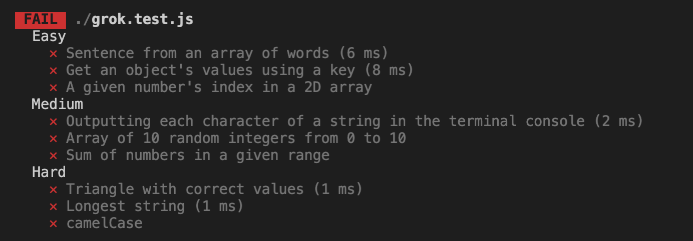
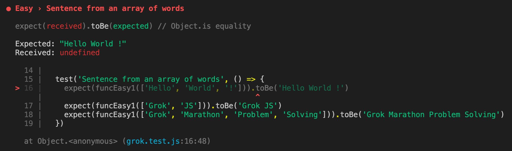

# grok-js-base 🐣

### How to use
The project directory contains three folders with exercises broken down by difficulty with three files in each. One file = one exercise.
  
#### Use tests to test your knowledge:

1. After cloning the repository, open console in your project folder and run the command `npm i`
2. After completing an exercise, run the command `npm test` to validate your code

#### To see which tests you passed, scroll up in console:
  
  

#### For more information on test failures, see:
```  
Expected: what the test expected  
Received: what you received  
```  
  

### Release 0
Complete the exercises in the **Easy** folder

### Release 1
Complete the exercises in the **Medium** folder

### Release 2
Complete the exercises in the **Hard** folder. In these assignments, you will need to write the function arguments yourself.   

⚠️ When pushing, take note that the master branch in this repository is called main-eng, not master-eng.
