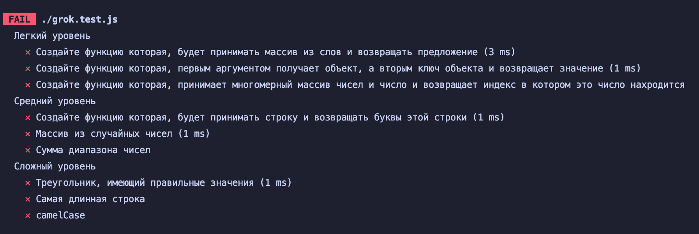
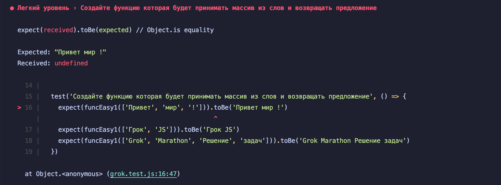

# js-grok

В этом задании нужно выполнить тесты <br>
У вас есть 3 папки разбитые по сложности <br>
- Easy
- Normal
- Hard

### Чтобы запустить тесты напишите эти команды в консоль
```
 npm i 
 npm test
```
### Чтобы посмотреть какие тесты вы прошли, прокрутите консоль вверх



### Чтобы узнать больше информации о не пройденном тесте, посмотрите:

```
Expected: что ожидал тест
Recived: что получилось у вас
```


